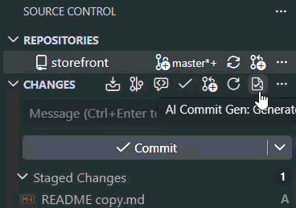
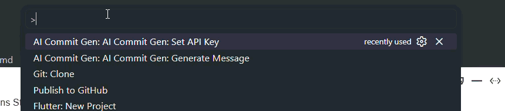
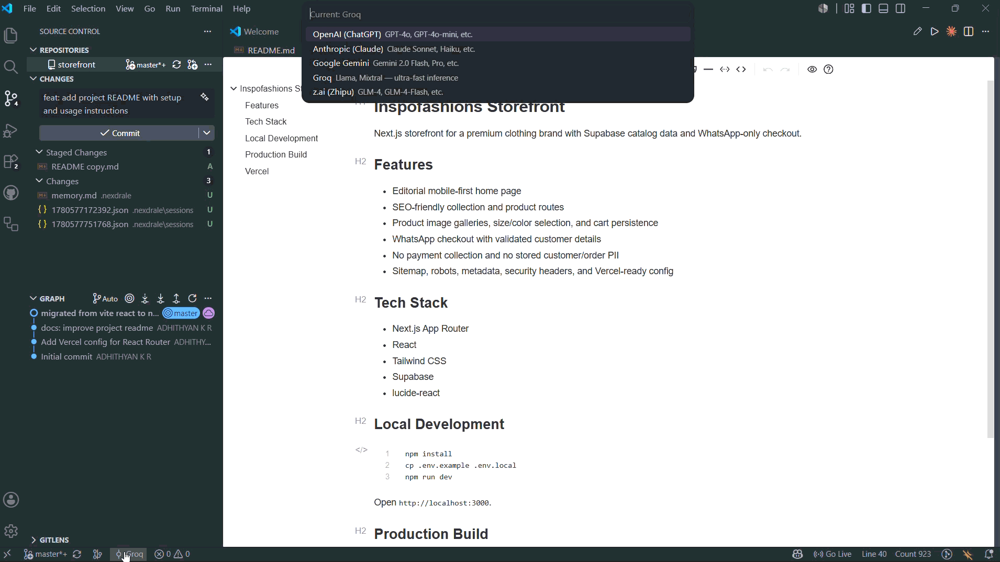

# Spreadle AI Commit Writer

Spreadle AI Commit Writer writes Conventional Commit messages from your Git changes directly inside VS Code's Source Control view.

## Features

- Generate commit messages from the Source Control toolbar.
- Fill the Git commit message input automatically.
- Auto-stage unstaged and untracked changes when nothing is staged.
- Show a loading state while the provider is generating.
- Switch between OpenAI, Anthropic Claude, Google Gemini, Groq, and z.ai.
- Store API keys securely with VS Code Secret Storage.



## Usage

1. Open a Git repository in VS Code.
2. Make a change in your project.
3. Open Source Control.
4. Click the Spreadle AI Commit Writer button in the Source Control toolbar.
5. If prompted, choose a provider and set its API key.
6. Review the generated message, then commit.

If files are already staged, Spreadle AI Commit Writer generates from the staged diff only. If nothing is staged and `aiCommitGen.autoStage` is enabled, it stages all current changes first.

## Set Your API Key

The first time you generate a commit message, Spreadle AI Commit Writer asks which provider to use and prompts for that provider's API key. You can also set or replace a key at any time from the Command Palette.

1. Open the Command Palette with `Ctrl+Shift+P` or `Cmd+Shift+P`.
2. Run `AI Commit Gen: Set API Key`.
3. Choose your provider.
4. Paste the API key when prompted.



API keys are saved in VS Code Secret Storage. They are not written to your repository.

## Change Provider or Model

Use the Command Palette when you want to switch providers without editing settings manually.

1. Open the Command Palette with `Ctrl+Shift+P` or `Cmd+Shift+P`.
2. Run `AI Commit Gen: Switch Provider`.
3. Choose OpenAI, Anthropic Claude, Google Gemini, Groq, or z.ai.



To change the exact model used by a provider, open VS Code Settings and search for `AI Commit Gen`. Update the matching setting, such as `aiCommitGen.openai.model`, `aiCommitGen.anthropic.model`, or `aiCommitGen.gemini.model`.

## Commands

- `AI Commit Gen: Generate Message`
- `AI Commit Gen: Switch Provider`
- `AI Commit Gen: Set API Key`

## Settings

| Setting | Default | Description |
| --- | --- | --- |
| `aiCommitGen.provider` | `openai` | AI provider used for generation. |
| `aiCommitGen.autoStage` | `true` | Stage all changes before generation when nothing is staged. |
| `aiCommitGen.maxDiffSize` | `10000` | Maximum diff size sent to the provider. |
| `aiCommitGen.openai.model` | `gpt-4o-mini` | OpenAI model. |
| `aiCommitGen.anthropic.model` | `claude-sonnet-4-20250514` | Anthropic model. |
| `aiCommitGen.gemini.model` | `gemini-2.0-flash` | Gemini model. |
| `aiCommitGen.groq.model` | `openai/gpt-oss-120b` | Groq model. |
| `aiCommitGen.groq.fallbackModel` | `qwen/qwen3.6-27b` | Fallback Groq model used when the primary model is unavailable. |
| `aiCommitGen.zai.model` | `glm-4-flash` | z.ai model. |

## Privacy

AI Commit Gen sends the selected Git diff to the configured AI provider. API keys are stored in VS Code Secret Storage and are not written to repository files.

Review generated messages before committing. Disable `aiCommitGen.autoStage` if you want to manually control exactly which files are included.

## Local Development

```powershell
npm install
npm run compile
```

Press `F5` in VS Code to launch an Extension Development Host.

## Package Locally

```powershell
npm run package
```

Install the generated VSIX:

```powershell
code --install-extension spreadle-ai-commit-gen-0.1.1.vsix
```

## Publish

Create or verify the `spreadle` publisher in the Visual Studio Marketplace, then run:

```powershell
npx vsce login spreadle
npx vsce publish
```

The extension is bundled with esbuild before packaging and publishing.
